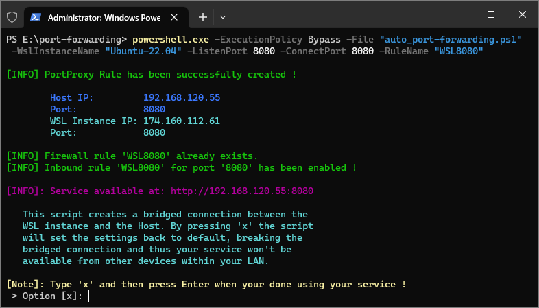

# WSL2 Port Forwarding - Script



When a service is running in a WSL instance, like Ubuntu for example, we want the service
to be accessible from any device that is connected to the local network.

This script automates the configuration process of a bridged connection between a WSL 
Instance and the Host. Thus, forwarding the TCP port of a WSL 2 service to the Host.

## Table of Contents

- [Prerequisites](#prerequisites)
- [Usage](#usage)
	- [Command Syntax](#command-syntax)
	- [Parameters](#parameters)
	- [Example](#example)
- [Author](#author)
- [License](#license)

## Prerequisites

To run this script, you will need the following:

- Windows 10 (version 1903 or later)
- PowerShell (version 5.1 or later)
- WSL2

## Usage

1. Download [auto_port-forwarding.ps1](auto_port-forwarding.ps1) to your local machine.
2. Open a *PowerShell* terminal (*Run as administrator*).
3. Navigate to the directory where the script is located.
4. Make sure the *WSL Instance*, on which the service is running, is set as *Default*
	- Run: `wsl -l -v` to list all the WSL Instances
	- If the WSL Instance, on which your service is running, is not set as default then run: <br> `wsl --setdefault <WSL_DISTRO_NAME>`
5. Run the script using the following command:

	### **Command Syntax**

	```powershell
	powershell.exe -ExecutionPolicy Bypass -File "auto_port-forwarding.ps1" -WslInstanceName <WSL_DISTRO_NAME> -ListenPort <LISTENING_PORT> -ConnectPort <SERVICE_PORT> -RuleName <FIREWALL_INBOUND_RULE_NAME>
	```

	### **Parameters**

	- `-WslInstanceName <WSL_DISTRO_NAME>` <br>
		The name of the WSL Instance on which the service is running
	
	- `-ListenPort <LISTENING_PORT>` <br>
		The port number which your service will be accessible from within your LAN
	
	- `-ConnectPort <SERVICE_PORT>` <br>
		The port number of the service that is running on the WSL Instance
	
	- `-RuleName <FIREWALL_INBOUND_RULE_NAME>` <br>
		The name of the inbound rule that will be created in Firewall. <br>
		This can be any name. For example you can name it "WSL8080".

	### **Example**

	Here's an example of how to use the command to run the script:

	```powershell
	powershell.exe -ExecutionPolicy Bypass -File "auto_port-forwarding.ps1" -WslInstanceName "Ubuntu-22.04" -ListenPort 8080 -ConnectPort 8080 -RuleName "WSL8080"
	```

6. Follow the on-screen instructions.

## Author

- [Alex R.](https://github.com/alexandrurapanu)

## License

This project is licensed under the [MIT License](./LICENSE).